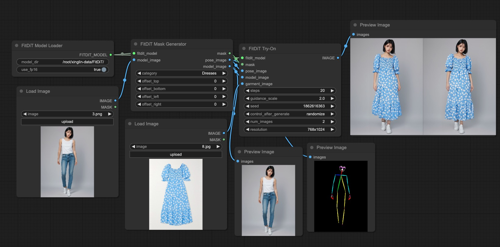

# ComfyUI-FitDiT

[中文版](./README_zh.md)

This repository is based on [https://github.com/BoyuanJiang/FitDiT](https://github.com/BoyuanJiang/FitDiT) and simply wraps it as nodes for ComfyUI.

## Installation

Step 1: Apply for access to FitDiT's [model weights](https://huggingface.co/BoyuanJiang/FitDiT), then clone the model to _local_model_dir_ (e.g., _models/FitDiT_) directory

Step 2: Clone this repository to the _custom_nodes_ directory of _ComfyUI_

Step 3: Enable FitDiT nodes in ComfyUI
Example workflow: [example_workflow/fitdit.json](example_workflow/fitdit.json)
The `model_dir` parameter in FitDiT Model Loader node needs to be set to _local_model_dir_ (e.g., _models/FitDiT_) directory, which is the model directory from Step 1.

> **Note:** The first run will download _openai/clip-vit-large-patch14_ and _laion/CLIP-ViT-bigG-14-laion2B-39B-b160k_ models, please be patient (if you don't have them locally).

## TODO LIST

- Custom mask optimization

